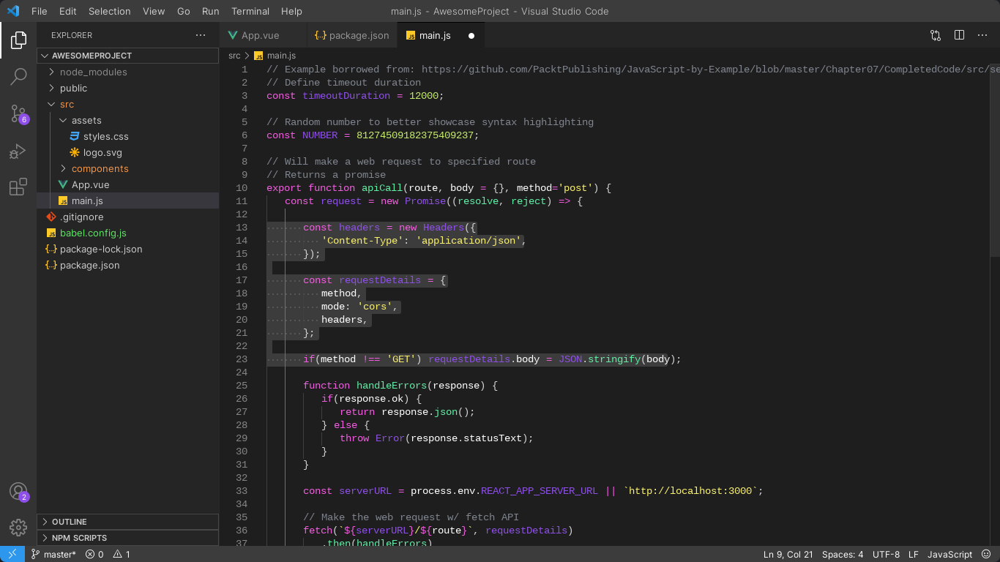
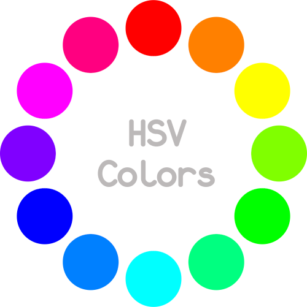

# README

## About

This a theme for visual Studio Code created by Eduardo Nóbrega using the HSV3 color palette.

## Preview

## Color Palette

<!-- ## HEX Color codes

#1e1e1e
#3c3c3c

#c5ed6a
#faf16e
#f69646
#f24239
#f259a7
#f15ddf
#8e4fe9
#0047e7
#2c97ec
#5cf4f7
#5fefa4
#5fea65  

-->
